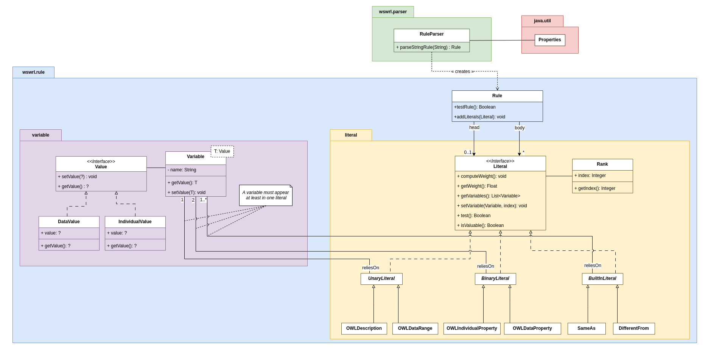

# W-SWRL
This repository contains the implementation of the W-SWRL reasoner. W-SWRL is an extension of SWRL that deals with missing data and hierarchical body literals. W-SWRL are description logic horn clauses that support classical SWWRL rule elements (i.e., unary predicates, binary predicates, built-in, and variables). Body literals of W-SWRL rules are assigned to ranks ranging from rank $r_0$ to $r_m$ ($m \geq 0$), and the head literal is associated with a confidence indicator ranging in the interval [0; 1].

Ranks denote the importance of the body literals. Necessary literals (i.e., those which must be satisfied) are assigned to rank $r_0$ and the less important to rank $r_m$.

The head literal confidence indicates how much body literals are satisfied. This confidence valuates the head literals even if data are missing and considers the different influences of the body literals (expressed with weights).

We let the reader refer to the article [**COMMING SOON**] for more details.

# How to run this code
## Command
To run the project, go to the root of the repository and execute the following command:
```
mvn clean install exec:java
```

See the rest of this section for project requirements and code dependencies.

## Requirements
The code provided in this repository can be run using **Java 8 or higher**.

This project relies on [Maven](https://maven.apache.org/install.html) for compilation, execution, and managing dependencies.


## Dependencies
This project depends on the following packages:

<!-- - A compléter ! -->
- *All the required packages by Maven to manage the project.*

# Implementation details
## Class diagram
The [following figure ](#class_diagram) presents the project class diagram. Further changes may be made to the diagram in the future.

|<a name="class_diagram"></a>|
|:--:| 
| *Project class diagram. The original picture can be found in the "/doc" folder* |